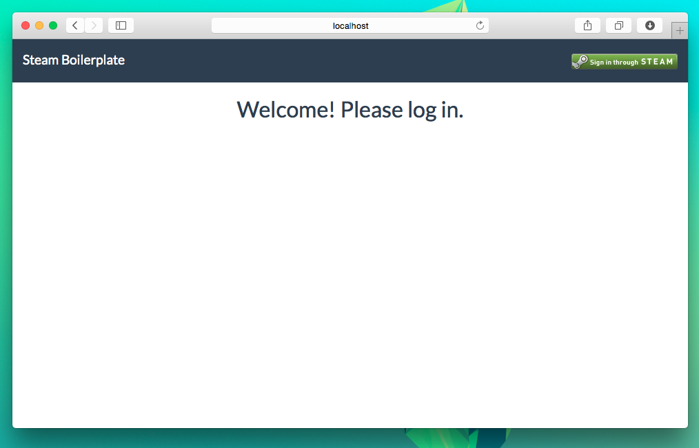
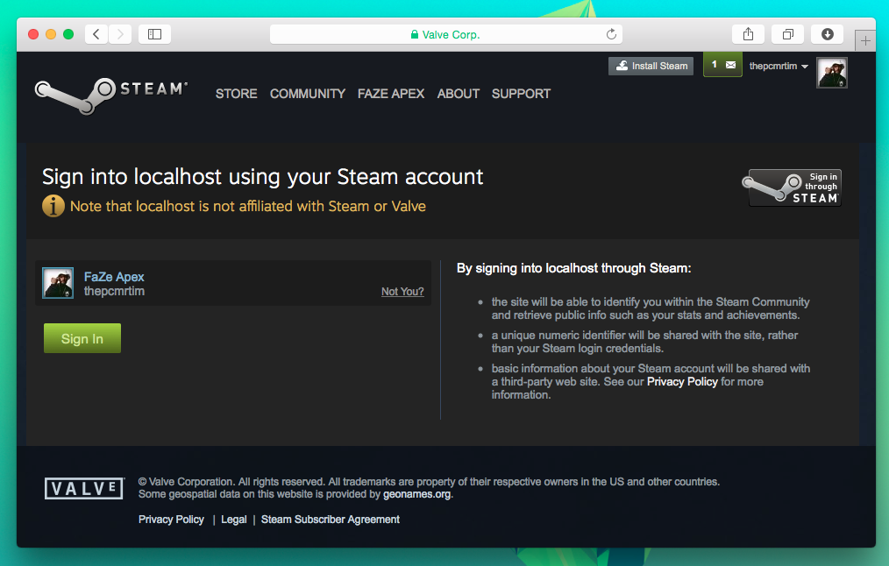
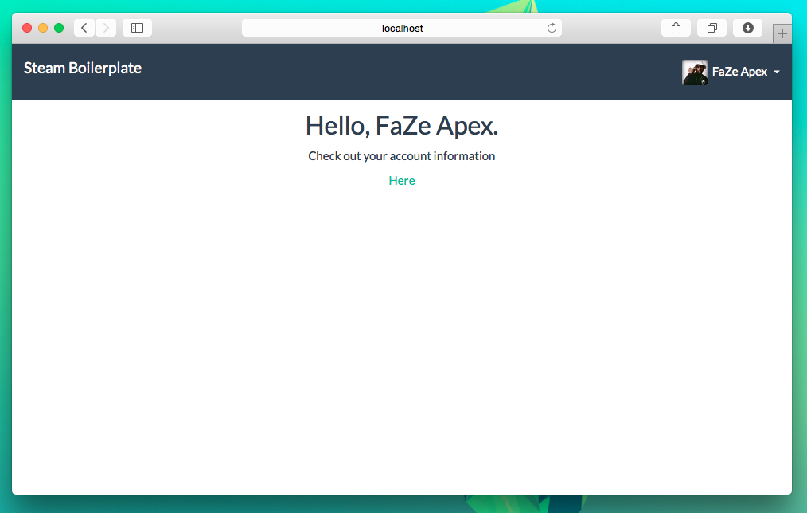
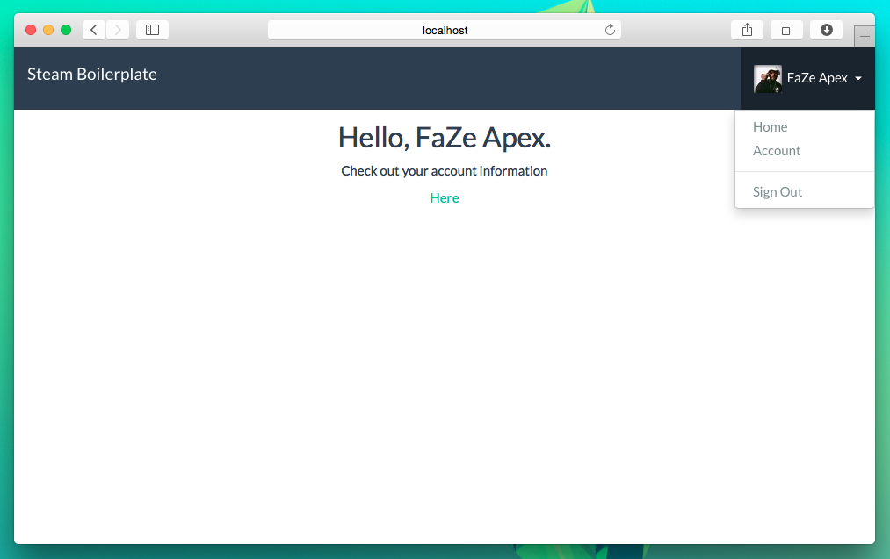
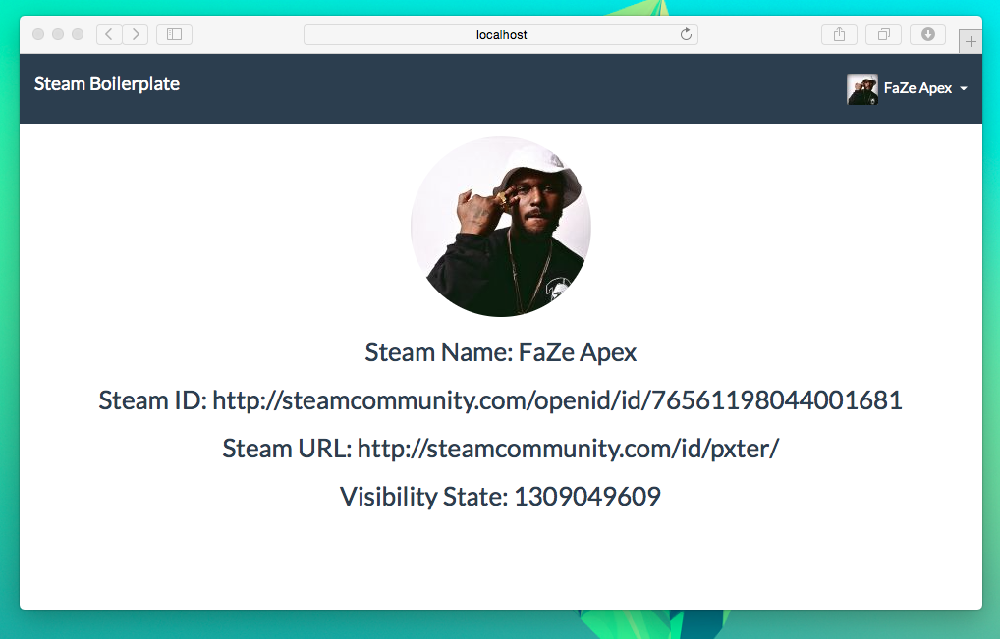

# Steam Boilerplate
Steam Authentication Example, using Passport and Node.

Install the packages by running
`npm install`

On line 19 in server.js where it says `apiKey: 'YOUR_API_KEY'`insert your own Steam API Key, if you don't have one
already get one <a href="http://steamcommunity.com/dev">here</a>.

Run the application by typing
`node server.js`

Open up Steam Boilerplate by typing `localhost:3000` in your browser.

#Screenshots
</img>
</img>
</img>
</img>
</img>
